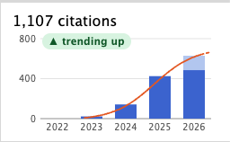

# Citation Trends

Citations per year on every arXiv abstract page, with a projection for this year and a trend label. Not affiliated with or endorsed by arXiv.



## Install

```sh
npm install && npm run build
```

Open `chrome://extensions`, turn on Developer mode, click **Load unpacked** and pick `dist/`.

Data comes from [Semantic Scholar](https://www.semanticscholar.org). An optional free [API key](https://www.semanticscholar.org/product/api#api-key-form) in the extension options speeds up loading. [How it works](docs/how-it-works.md) · [Privacy](PRIVACY.md).
